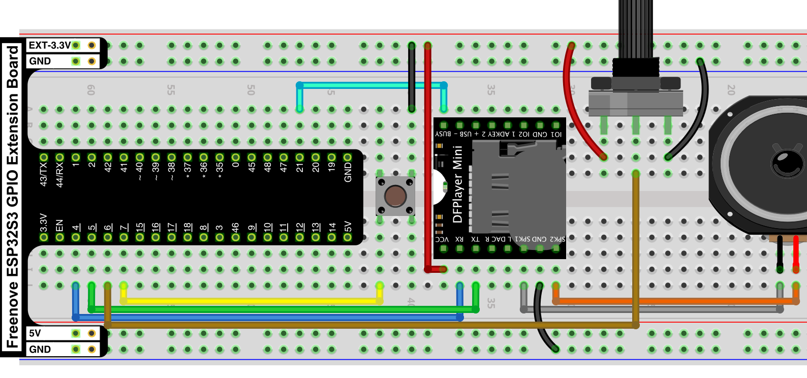

# MP3 - Asyncio

Það er til micropython asyncio rekill (e. driver) fyrir [DFPlayer MP3](https://wiki.dfrobot.com/DFPlayer_Mini_SKU_DFR0299) spilarann sem þú finnur [hér](https://github.com/Muhlex/dfplayer-mp).

Til að setja rekilinn inn þarftu að afrita [þessar](https://github.com/Muhlex/dfplayer-mp/tree/main/src/dfplayer) skrár og setja í möppu sem á að heita *dfplayer* í *lib* möppunni á rótinni á ESP-num:

```bash
lib/
└── dfplayer/
    ├── __init__.py
    └── dfplayer.py
```

Á SD kortinu *verða* svo allar hljóðskrár að vera í möppum. Möppurnar verða að heita 01, 02, 03 o.s.frv. Skrárnar í möppunum *verða* að heita 001.mp3, 002.mp3 o.s.frv. Ef nafn á að vera á skránni þarf það að koma á eftir tölunum, t.d. 001_abc.mp3.

## Tengingar



## Kóðun
```python
from machine import Pin, ADC
import asyncio
from lib.dfplayer import DFPlayer

df = DFPlayer(1) 
df.init(tx=4, rx=5) # tx á esp tengist í rx á mp3

stillividnam = ADC(Pin(6), atten=ADC.ATTN_11DB)
start_stop_takki = Pin(7, Pin.IN, Pin.PULL_UP)
er_ad_spila = Pin(21, Pin.IN, Pin.PULL_UP) # 0 mp3 er að spila, 1 mp3 er ekki að spila

a_ad_spila = False
stada_ss_takka_adur = 1

async def main():
    global a_ad_spila, stada_ss_takka_adur
    await df.wait_available() # bíðum eftir að spilarinn er tilbúinn
    while True:
        stada_ss_takka = start_stop_takki.value()
        if stada_ss_takka == 0 and stada_ss_takka_adur == 1:
            a_ad_spila = not a_ad_spila
        stada_ss_takka_adur = stada_ss_takka
        
        if a_ad_spila == True:
            if er_ad_spila.value() == 1:
                print("spila lag")
                await df.play(3,4) # spila lag 4 í möppu 3
        else:
            if er_ad_spila.value() == 0:
                await df.stop()
                
        hljodstyrkur = stillividnam.read() // 128 # lækka gildið í 0 til 31
        hljodstyrkur = max(0, min(30, hljodstyrkur)) # klemma gildið milli 0 og 30
        await df.volume(hljodstyrkur)
        await asyncio.sleep_ms(0) # þarf ekki í þessu tilfelli en má vera

asyncio.run(main())
```
