## Uppsetning á RPi og Mediapipe

### Uppesetning á RPi

Sækja, setja upp og ræsa [Raspberry Pi Imager](https://www.raspberrypi.com/software/).

Velja viðeigandi Raspberry Pi 

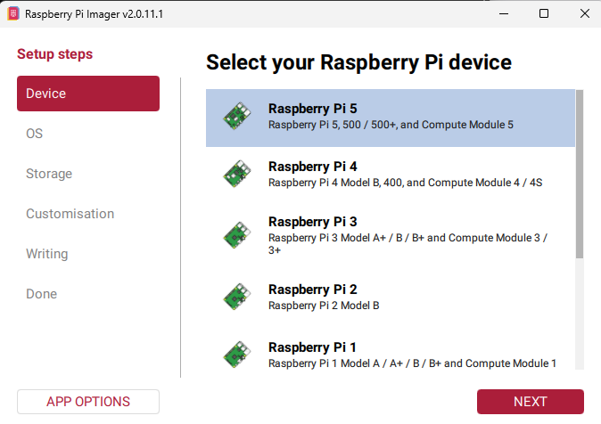

Skruna svo niður þar til "Raspberry Pi OS (other)" finnst og velja það.

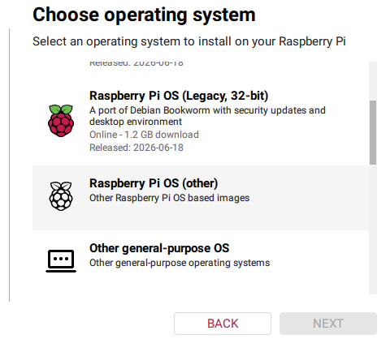

Skruna svo aftur niður þar til "Raspberry Pi OS (Legacy, 64-bit) finnst og velja það (Bookworm).

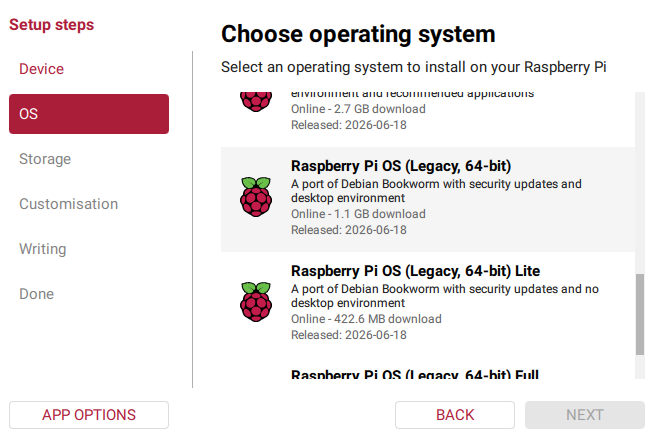

Veldu svo SD kortið.

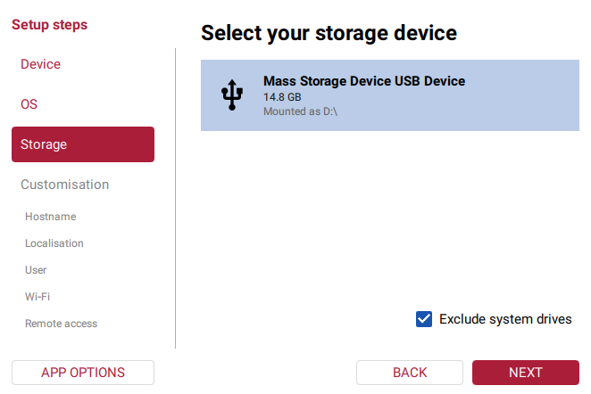

Skráðu svo "hostname", það á að vera hYXX þar sem YXX er númer sem kennarinn úthlutar þér.

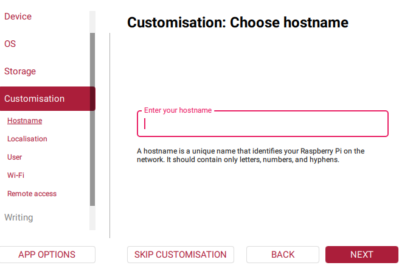

Stilltu svo "Localisation" á eftirfarandi hátt:

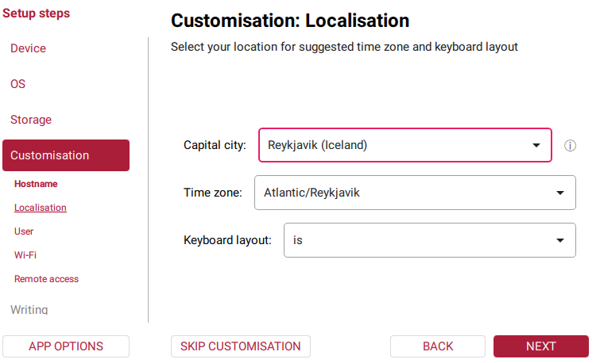

Hafður notendanafnið `pi` og lykilorðið `Verksm1dja` (ath. 1 í stað i).

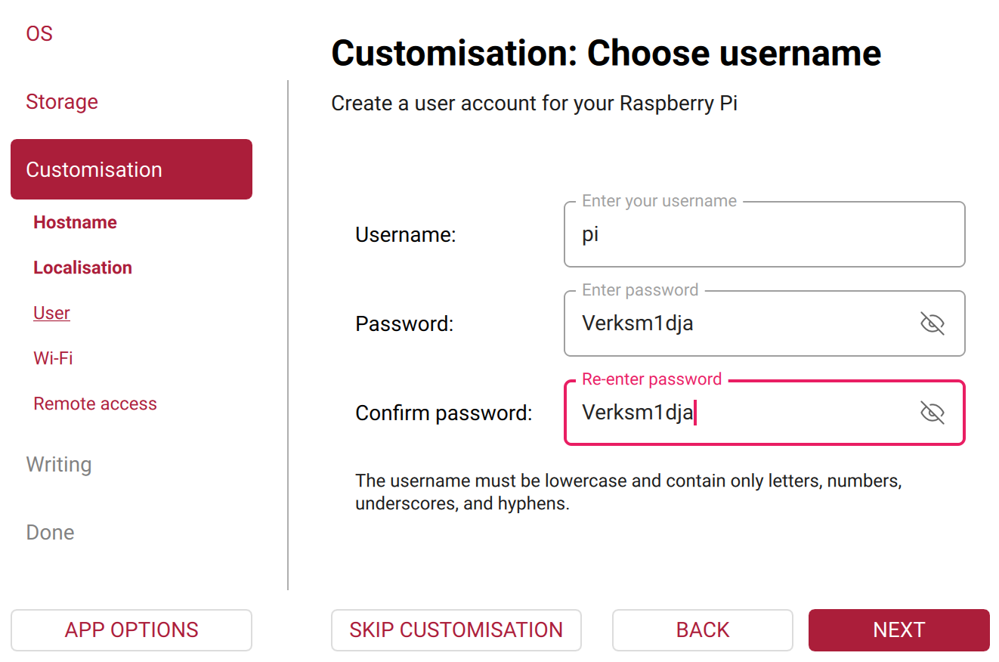

Í "Choose Wi-Fi", hafðu SSID `TskoliVESM` og lykilorðið `Fallegurhestur`.

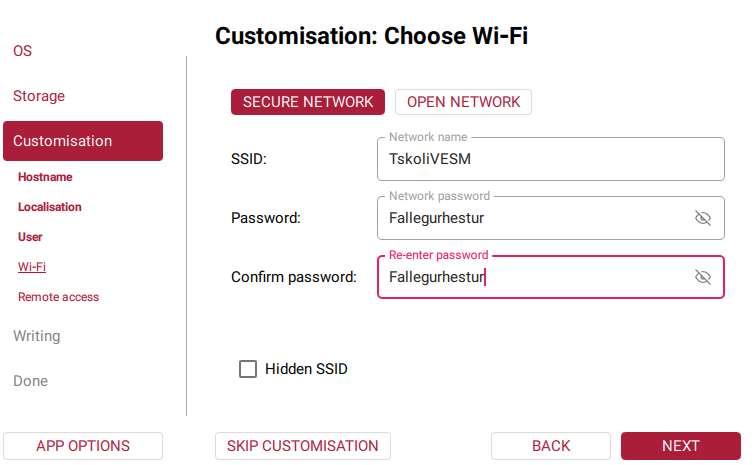

Í "SSH authentication" virkjaðu "Enable SSH" og hafðu hakað í "Use password authentication".

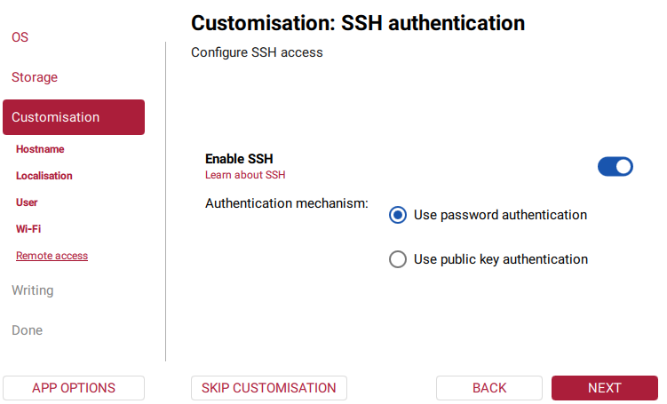

Smelltu að lokum á "WRITE" og veldu "I UNDERSTAND ...."
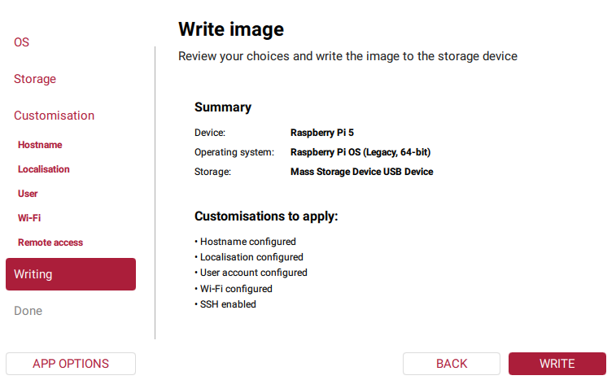
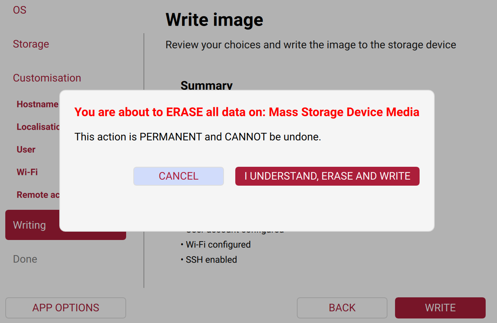

Uppsetningin tekur um það bil 15 mínútur.

#### Tengjast RPi með SSH 

:warning: Til að geta tengst RPi með SSH þá þarf fartölvan þín að vera tengd ```TskoliVESM``` þráðlausa netinu (lykilorð ```Fallegurhestur```) :warning:

Eftir að RaspberryPi hefur verið tengdur rafmagni þarf að gefa honum tvær til þrjár mínútur til að ræsa í fyrsta skipti.

Tengstu RPi með SSH með því að slá eftirfarandi inn í Terminal (PowerShell á Windows, Terminal á Apple):

```bash
ssh pi@vesmhYXX
```

Lykilorðið er ```Verksm1dja``` (ath. 1 (einn) í stað i).

Þar sem Y er hópurinn sem þú ert í og XX númerið á SSD kortinu sem þú fékkst.

#### Tengjast RPi með VNC

Næst þarf að virkja ```VNC``` þjónustuna.

```bash
sudo raspi-config
```

Veldu svo ```Interface Options```. Notaður örvatakkana til að færa þig upp/niður og síðan Tab takkann til að velja ```<Select>``` þar sem þú smellir að Enter.


Veldu svo í VNC og veldu ```<Yes>```.


Að lokum velur þú svo ```<Finish>``` til að komast út úr ```raspi-config```

1. Náðu í [VNC viewer](https://www.realvnc.com/en/connect/download/viewer/) í fartölvuna, búðu til reikning.
    1. Búðu til VNC tengingu (New Connection) í File.
       ```
       VNC Server:  hostname    # eða iptala 
       user:  pi
       lykilorð: Verksm1dja        
       ```
    1. Tvísmelltu á tenginguna, notendafnið er `pi` (ekki breyta) og lykilorð. 
1. Núna getur þú tengst RPi með fartölvunni 

#### Mediapipe uppsetning

Á RPi keyrðu eftirfarandi til að sækja uppsetningarskriftu:
```bash
wget https://raw.githubusercontent.com/VESM3/IOT/main/Kodi/setup_pi.sh
```

Næst þarf að gera skriftuna keyranlega.

```bash
chmod +x setup_pi.sh
```

Og loks að keyra hana.

```bash
./setup_pi.sh
```

#### Prófun

Tengstu RPi með VNC, opnaðu þar terminal og keyrðu eftirfarandi:
```bash
cd ~/mediapipe_test
source venv/bin/activate
python test_mediapipe.py
```
